# Weighing Black Holes Using Deep Learning
_**Contributors: Joshua Yao-Yu Lin, Sneh Pandya, Devanshi Pratap, Xin Liu, Matias Carassco Kind, Volodymyr Kindratenko**_

The goal of this project is to introduce a new, interdisciplinary method in weighing supermassive black holes (SMBH).  We employ a hybrid neural convolutional neural network (CNN) and feedforward neural network (FNN) alongside robust data preprocessing.  We use light curves from the SDSS Stripe 82, virial SMBH mass estimates from SDSS DR7, DR14 datasets as ground truth, and parameters from the SDSS Damped Random Walk catalog.

# Abstract
Supermassive black holes are ubiquitously found at the center of galaxies. Also known as quasars, they are actively accreting hot gas and material and are extremely difficult to observe, let alone observe the necessary information to determine mass.

There is currently no efficient method for accurately weighing supermassive black holes outside of our galaxy.  Developing a catalog of quasar masses is important in understanding large scale structure evolution of galaxies, as well using them as “standard candles” in astronomy. The emergence of astroinformatics and continuous applications of computer science, and most notably deep learning (DL) in astronomy has motivated this project.

The goal of this project is to develop an algorithm that weighs SMBH using quasar time series instead of atomic spectra. There are theoretical reasons to believe this relationship between time series data and black hole mass exist, and is pioneered Prof. Xin Liu. The theorized non-linearity motivates the use of DL in this project. The questions addressed are whether current methods in DL can be used to make accurate black hole mass predictions of known data sets.

# Environment

This project is developed for Python3.5 interpreter on linux machine. Using Anaconda virtual environment is recommended.

To install dependencies, simply run:

`pip install -r requirement.txt`

or consult online documentation for appropriate dependencies.

# Data sets

1. SDSS Stripe 82 light curves: http://faculty.washington.edu/ivezic/macleod/qso_dr7/Southern.html

2. SDSS Stripe 82 light curves (expanded catalog): https://github.com/RichardsGroup/LSST_training

3. SDSS DR7 data: http://quasar.astro.illinois.edu/BH_mass/dr7.html

4. SDSS DR14 catalog: https://sites.utu.fi/sdssdr14/

# Code
### Getting data in desired format

The process of retrieving the expanded catalog of light curves is explained in detail at the RichardsGroup Github linked above.  We thank the Drexel University group for compiling this catalog and Weixiang Yu for his guidance in retrieving the light curves.

`src/data/dr14_LC.csv`
Data from RichardsGroup light curve catalog.  ML feature extraction pipeline doesn't use full light curves. The colors and bands in this data are directly from point-spread function (PSF) magnitudes.

`src/notebooks/dr7_dr14_tutorial.ipynb`
Retrieve DR7/DR14 catalog and relevant information.  Clean unphysical and high-error AGN SMBH mass estimates.  Visualize data from the catalog.
Outputs:
- `src/data/dr14_BH.csv`

`src/notebooks/match_dr14_LC_BH`
Match Stripe 82 light curve data (PSF magnitudes) with DR14 catalog for ML pipeline.  Split matched data into train and test sets.
Outputs:
- `src/data/matched_dr14.csv`
- `src/data/TRAIN_dr14.csv`
- `src/data/TEST_dr14.csv`

`src/scripts/clean_stripe82.py`:
Get SDSS Stripe 82 light curves (UWashington) and clean it. Generate a .csv file of cleaned data (data in a desirable format). RA/DEC used to match light curves with DR7/DR14 catalogs.

`src/scripts/data_matching.py`:
To match the Stripe 82 (UWashington) and the DR7 catalog data to get most relevant information. Generate a .csv file of matched data.

`src/scripts/light_curve_to_image_full.py`: Convert SDSS Stripe 82 light curves to images as .npy files to be readable by neural network.
<!--
`src/scripts/split_data.py`: Module to split data into training and testing sets.

`src/scripts/random_reject.py`: Script to randomly reject data points from light curve files and generate new numpy files.  Used to test lower-end benchmark of when network stops performing well. -->

### Deep learning
`src/notebooks/AGNet_FNN.py`: AGNet FNN architecture.  Uses preprocessed data and extracted features.  Trained on PSF magnitudes from RichardsGroup light curves and DR14 masses as ground truth. 

`src/scripts/neural_network.py` : Our convolutional neural network for predicting black hole mass

<!-- `src/notebooks/plot_skymap.ipynb`: Skymap of complete Stripe 82 and DR7 datasets in radial ascension vs declination coordinates.

`src/notebooks/plot_mass_and_error.ipynb`:  Statistical analysis to visualize error information across all mass data and statistical analysis to visualize error information as a function of mass. As expected, lower mass SMBH have a wider spread of errors.

`src/notebooks/plot_light_curve.ipynb`: Example light curve of u,g,r,i,z bands and respective error information from Stripe 82 dataset and example of an unphysical light curve.  This is usually do to anomaly in telescope observation.  Such light curves are removed for training.

`src/notebooks/plot_simulated_light_curve.ipynb`:  Example of a simulated light curve using one standard deviation error from error information present in DR7 & S82 datasets.  Simulation assumes identical ID and redshift information from source light curve, and simulated new band magnitudes.

`src/notebooks/plot_2d_light_curve_image.ipynb` : Example of a 224 x 224 numpy array visualized as a image that will be fed into our neural network.  These images numpy images encode the same information as our light curves.

`src/notebooks/plot_z_simulated_results.ipynb` : Results for our neural network for redshift using our 10x simulated dataset.

`src/notebooks/plot_mass_simulated_results.ipynb` : Results for our neural network for mass using our 10x simulated dataset. -->

<!-- # Plots

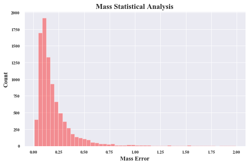

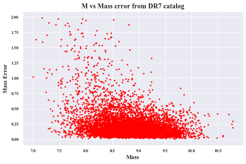

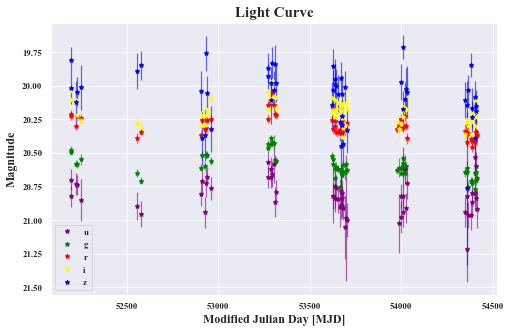

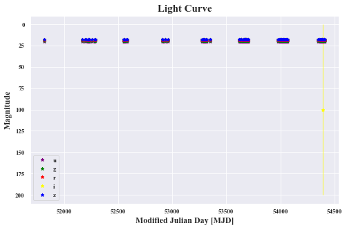

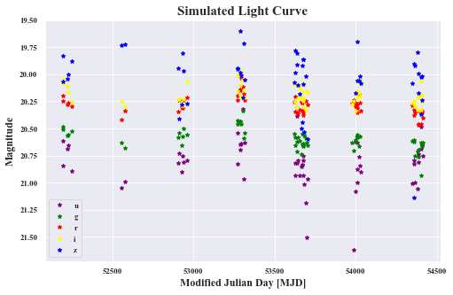

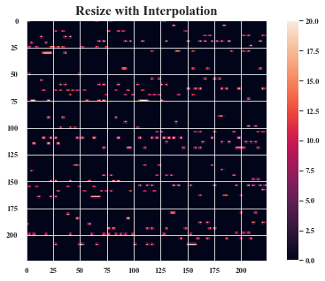

# Results

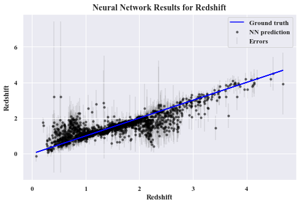

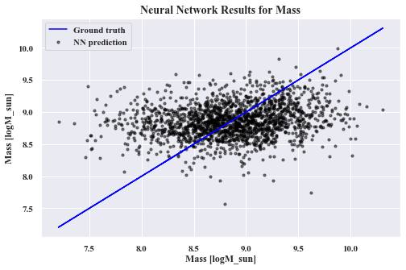

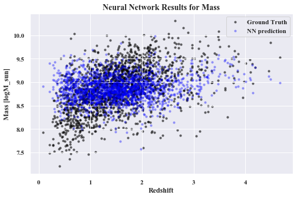

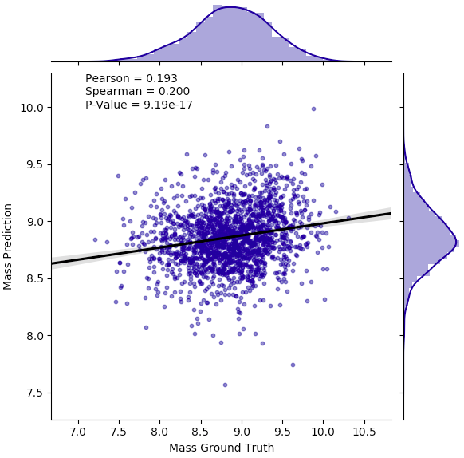

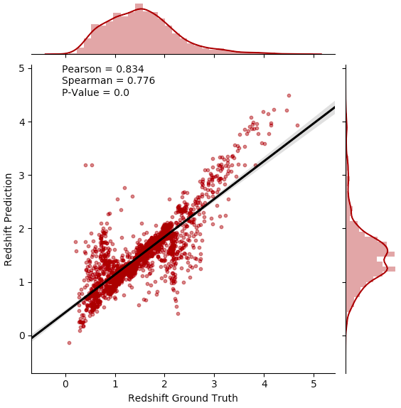
 -->
# References

1. Pasquet-Itam, J., and J. Pasquet. “Deep Learning Approach for Classifying, Detecting Andpredicting Photometric Redshifts of Quasars in the Sloan DigitalSky Survey Stripe 82.” Astronomy & Astrophysics, vol. 611, 2018

2. Sun, Mouyuan et al. “Corona-Heated Accretion-Disk Reprocessing: A Physical Model to Decipher the Melody of AGN UV/Optical Twinkling.” The Astrophysical Journal 891.2 (2020): 178. Crossref. Web.
