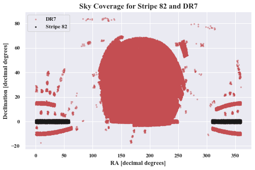

# Weighing Black Holes Using Deep Learning
_**Contributors: Xin Liu, Joshua Yao-Yu Lin, Devanshi Pratap and Sneh Pandya**_

The goal of this project is to introduce a new, interdisciplinary method in weighing supermassive black holes (SMBH).

# Abstract
Supermassive black holes are ubiquitously found at the center of galaxies. Also known as quasars, they are actively accreting hot gas and material and are extremely difficult to observe, let alone observe the necessary information to determine mass.

There is currently no efficient method for accurately weighing supermassive black holes outside of our galaxy.  Developing a catalog of quasar masses is important in understanding large scale structure evolution of galaxies, as well using them as “standard candles” in astronomy. The emergence of astroinformatics and continuous applications of computer science, and most notably deep learning (DL) in astronomy has motivated this project.

The goal of this project is to develop an algorithm that weighs SMBH using quasar time series instead of atomic spectra. There are theoretical reasons to believe this relationship between time series data and black hole mass exist, and is pioneered Prof. Xin Liu. The theorized non-linearity motivates the use of DL in this project. The questions addressed are whether current methods in DL can be used to make accurate black hole mass predictions of known data sets.

# Environment

This project is developed for Python3.5 interpreter on linux machine. Using Anaconda virtual environment is recommended.

To install dependencies, simply run:

`pip install -r requirment.txt`

or consult online documentation for appropriate dependencies.

# Data sets

1. SDSS Stripe 82 data: http://faculty.washington.edu/ivezic/macleod/qso_dr7/Southern.html
2. SDSS DR7 data: http://quasar.astro.illinois.edu/BH_mass/dr7.htm

# Code
### Getting data in desired format

`src/scripts/clean_stripe82.py`:
Get SDSS Stripe 82 data and clean it. Generate a .csv file of cleaned data (data in a desirable format).

`src/scripts/clean_dr7.py`:
Get SDSS DR7 data and clean it. Generate a .csv file of cleaned data (data in a desirable format).

`src/scripts/data_matching.py`:
To match the Stripe 82 and the DR7 catalog data to get most relevant information. Generate a .csv file of matched data.

`src/scripts/light_curve_to_image_full.py`: Convert SDSS Stripe 82 light curves to images as .npy files to be readable by neural network.

`src/scripts/split_data.py`: Module to split data into training and testing sets.

### Deep learning
`src/scripts/neural_network.py`:

### Visualization
`src/notebooks/plot_skymap.ipynb`: Skymap of complete Stripe 82 and DR7 datasets in radial ascension vs declination coordinates.

`src/notebooks/plot_mass_and_error.ipynb`:  Statistical analysis to visualize error information across all mass data and statistical analysis to visualize error information as a function of mass. As expected, lower mass SMBH have a wider spread of errors.

`src/notebooks/plot_light_curve.ipynb`: Example light curve of u,g,r,i,z bands and respective error information from Stripe 82 dataset and example of an unphysical light curve.  This is usually do to anomaly in telescope observation.  Such light curves are removed for training.
# Plots

<!--  -->

# Results
_Neural Network Plots here._

# References
_Will include a detailed list later._
